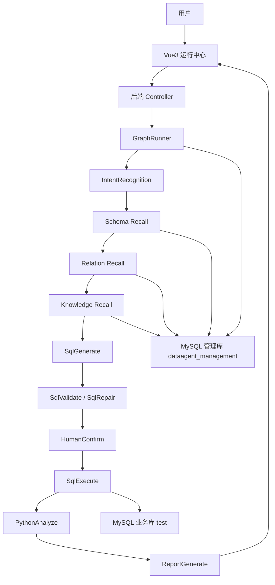

# DataAgent 智能数据分析工作台 / DataAgent Rebuild

## 一、项目简介

DataAgent Rebuild 是一个参考 **Spring AI Alibaba DataAgent** 架构思路实现的学习型智能数据分析工作台。项目基于 **Spring Boot + Vue3 + MyBatis + MySQL + OpenAI-compatible LLM**，从零拆解并重建了智能数据分析 Agent 的核心链路。

本项目目标不是一比一复刻官方 DataAgent，也不是完整生产级实现，而是跑通一条可演示、可复盘、可讲解的智能数据分析闭环：

```text
自然语言问数
-> Schema / Relation / Knowledge 召回
-> SQL 生成
-> SQL 提取 / 安全校验 / 修复
-> 可选人工确认
-> SQL 执行
-> Python 分析
-> Markdown / ECharts 报告
-> 运行历史追踪
```

当前项目支持自然语言问数、NL2SQL、RAG 知识增强、SQL 安全校验、Human-in-the-loop 人工确认、Python 受限沙箱分析、图表报告和运行历史追踪，适合课程项目、毕业设计、GitHub 展示和面试讲解。

## 二、核心能力

| 能力 | 说明 |
| --- | --- |
| Agent 管理 | 创建不同业务场景的数据分析 Agent，维护名称、描述、Prompt、预设问题等信息。 |
| 模型配置管理 | 管理 Mock、DeepSeek、OpenAI-compatible Chat / Embedding 模型配置。 |
| 数据源管理 | 维护 MySQL / H2 等业务数据源连接信息，并支持连接测试。 |
| Agent 数据源绑定 | 将 Agent 与可访问的数据源绑定，为问数链路提供数据范围。 |
| 语义模型管理 | 维护表语义、字段语义、业务名、同义词、描述、示例值等信息。 |
| 表关系维护与 Relation Recall | 维护 `orders.user_id -> users.id` 这类逻辑关系，辅助多表 JOIN。 |
| 业务知识管理与 Knowledge Recall | 支持业务知识、知识切片、Mock Embedding、TopK 知识召回和 fallback。 |
| Prompt 模板管理 | 管理 SQL 生成、SQL 修复、报告生成等 Prompt 模板。 |
| Graph / SSE 运行链路 | 以节点方式组织问数流程，支持普通运行和 SSE 流式事件输出。 |
| NL2SQL | 支持意图识别、Schema Recall、Relation Recall、Knowledge Recall、SQL 生成和执行。 |
| SQL 清洗、提取、校验、修复 | 支持从 Markdown / 解释文本中提取 SQL，拦截危险 SQL，并尝试修复。 |
| SQL 执行前人工确认 | SQL 执行前可暂停，用户确认、修改 SQL 或取消执行。 |
| Python 受限沙箱分析 | 使用后端模板生成受限 Python 代码分析 SQL 结果，失败时回退 Java 安全统计。 |
| Markdown + ECharts 报告 | 输出结构化报告、Markdown 报告、指标卡、柱状图、折线图和饼图。 |
| 运行历史与节点事件追踪 | 持久化 `graph_run` 和 `graph_event`，支持运行详情复盘。 |
| API Key / 密码加密与脱敏 | 模型 API Key 和数据源密码加密存储，接口和前端只展示脱敏信息。 |

## 三、技术栈

后端：

- Java 17+
- Spring Boot
- MyBatis
- MySQL
- H2
- Maven
- OpenAI-compatible API / DeepSeek
- Python ProcessBuilder 受限执行

前端：

- Vue3
- Vite
- Element Plus
- Axios
- ECharts
- markdown-it

数据库：

- MySQL 管理库：`dataagent_management`
- MySQL 演示业务库：`test`
- H2 开发模式

## 四、项目结构

项目真实根目录：

```text
D:\Downloads\DataAgent-main\DataAgent-main\spring ai
```

目录结构：

```text
spring ai/
├── data-agent-management/       # 后端 Spring Boot 服务
├── data-agent-frontend/         # 前端 Vue3 管理后台
├── docs/                        # 架构、API、演示、面试文档
├── scripts/                     # MySQL 初始化和启动脚本
├── README.md
└── pom.xml
```

## 五、系统架构图



## 六、核心运行链路

一次自然语言问数流程如下：

1. 用户在运行中心选择 Agent、Chat 模型、可选 Embedding 模型和运行模式。
2. 用户输入自然语言问题，例如：`每个用户的销售额是多少？`
3. `IntentRecognitionNode` 判断问题类型，危险写操作会在 SQL 生成前被拦截。
4. `SchemaRecallNode` 根据问题、表业务名、字段业务名、同义词和描述召回相关表字段。
5. `RelationRecallNode` 根据已召回表找到表关系，例如 `orders.user_id INNER JOIN users.id`。
6. `KnowledgeLoadNode` 使用 Knowledge Recall 召回相关业务规则和指标口径。
7. `SqlGenerateNode` 调用 Mock 或真实 OpenAI-compatible 模型生成 SQL。
8. `SqlExtractor / SqlValidator / SqlRepairNode` 提取 SQL、校验只读安全规则，并在必要时尝试修复。
9. 如果开启人工确认，`HumanConfirmNode` 会暂停执行，等待用户确认、修改或取消。
10. `SqlExecuteNode` 使用 JDBC 执行校验后的 SELECT SQL，自动 LIMIT、限制 maxRows 和 query timeout。
11. `PythonAnalyzeNode` 对 SQL 结果做 Java 安全统计或受限 Python 分析。
12. `ReportGenerateNode` 生成业务核心结论、Markdown 报告和 ChartSpec。
13. `GraphHistoryService` 保存 `graph_run` 和 `graph_event`，便于运行历史复盘。

## 七、快速启动

以下命令均基于 Windows PowerShell。

### 1. 进入项目目录

```powershell
cd "D:\Downloads\DataAgent-main\DataAgent-main\spring ai"
```

### 2. 创建 MySQL 管理库

```powershell
mysql -uroot -p123456 -e "CREATE DATABASE IF NOT EXISTS dataagent_management DEFAULT CHARACTER SET utf8mb4 COLLATE utf8mb4_unicode_ci;"
```

### 3. 初始化演示业务库

```powershell
Get-Content .\scripts\init-demo-mysql.sql -Encoding UTF8 | mysql -uroot -p123456
Get-Content .\scripts\check-demo-data.sql -Encoding UTF8 | mysql -uroot -p123456
```

### 4. 设置加密密钥

```powershell
$env:DATAAGENT_SECRET_KEY="please-change-this-to-a-random-32-byte-secret"
```

### 5. 启动后端 MySQL profile

```powershell
mvn -gs .mvn\settings.xml -pl data-agent-management spring-boot:run "-Dspring-boot.run.arguments=--spring.profiles.active=mysql"
```

PowerShell 下 `-Dspring-boot.run.arguments=...` 建议加引号，否则 Maven 可能把参数解析成 lifecycle phase。

### 6. 启动前端

```powershell
cd "D:\Downloads\DataAgent-main\DataAgent-main\spring ai\data-agent-frontend"
npm.cmd install
npm.cmd run dev
```

### 7. 访问系统

```text
http://127.0.0.1:3000
```

## 八、H2 / MySQL 模式说明

- H2 模式适合快速开发和接口调试，管理数据在重启后可能丢失。
- MySQL profile 适合持久化管理数据，推荐用于完整演示。
- `dataagent_management` 是管理库，保存 Agent、模型、数据源、语义模型、表关系、知识、Prompt、运行历史等配置。
- `test` 是业务库，保存 `orders`、`users` 等被分析的业务数据。
- `datasource` 表中保存业务库连接信息，但业务表不放在 `dataagent_management` 中。

H2 启动方式：

```powershell
cd "D:\Downloads\DataAgent-main\DataAgent-main\spring ai"
mvn -gs .mvn\settings.xml -pl data-agent-management spring-boot:run
```

MySQL profile 启动方式：

```powershell
cd "D:\Downloads\DataAgent-main\DataAgent-main\spring ai"
$env:DATAAGENT_SECRET_KEY="please-change-this-to-a-random-32-byte-secret"
mvn -gs .mvn\settings.xml -pl data-agent-management spring-boot:run "-Dspring-boot.run.arguments=--spring.profiles.active=mysql"
```

## 九、演示数据说明

演示业务库 `test` 中包含两张表：

`users`：

- Alice
- Bob

`orders`：

- Alice：100 + 200 = 300
- Bob：300
- 总销售额：600

可验证问题：

- `最近销售额是多少？`
- `每个用户的销售额是多少？`
- `退款订单是否计入销售额？`
- `删除所有订单`
- 开启人工确认后执行问数
- 开启 Python 沙箱后执行分析

## 十、前端验证流程

1. Agent 管理：创建 `Sales Analysis Agent`。
2. 模型配置：创建 `Mock Chat`，`provider=mock`，`modelType=chat`。
3. 模型配置：创建 `Mock Embedding`，`provider=mock`，`modelType=embedding`。
4. 数据源管理：创建 `Demo MySQL`，指向 `jdbc:mysql://localhost:3306/test`。
5. Agent 数据源绑定：绑定 Agent 和 Demo MySQL。
6. 语义模型：创建 `users`、`orders` 表和字段。
7. 表关系：创建 `orders.user_id INNER JOIN users.id`。
8. 知识管理：创建“销售额统计口径”“退款规则”，并绑定 Agent。
9. 知识管理：重建知识切片和 Mock Embedding 向量。
10. Prompt 模板：初始化默认模板。
11. 运行中心：
    - `最近销售额是多少？` -> 返回 600，展示 single_value 指标卡。
    - `每个用户的销售额是多少？` -> 返回 Alice 300 / Bob 300，展示 bar 图。
    - `退款订单是否计入销售额？` -> 识别为 business_rule，基于知识回答“退款订单不计入销售额”。
    - `删除所有订单` -> 被危险意图识别拦截，不生成 SQL、不执行 SQL。
    - 开启人工确认 -> `pending_confirm` -> 确认执行 -> `success`。
12. 运行历史：查看 `graph_run` 和 `graph_event`，复盘 SQL、节点事件、报告和错误信息。

## 十一、重要功能验收表

| 功能 | 问题 | 预期结果 | 状态 |
| --- | --- | --- | --- |
| 单表销售额统计 | 最近销售额是多少？ | 返回总销售额 600，图表为 single_value | 已实现 |
| 多表 JOIN | 每个用户的销售额是多少？ | 返回 Alice 300 / Bob 300，图表为 bar | 已实现 |
| Knowledge Recall 退款规则 | 退款订单是否计入销售额？ | 命中退款规则，回答退款订单不计入销售额 | 已实现 |
| SQL 危险意图拦截 | 删除所有订单 | SQL 生成前拒绝执行，不影响业务库数据 | 已实现 |
| 人工确认 | 开启执行前确认后问销售额 | 进入 pending_confirm，确认后继续执行 | 已实现 |
| Python 沙箱分析 | 开启 Python 后问每个用户销售额 | 执行受限 Python 分析或 fallback 到 Java 安全统计 | 已实现 |
| 运行历史 | 任意一次运行 | `graph_run` 和 `graph_event` 保存运行记录和节点事件 | 已实现 |
| 图表报告 | 每个用户的销售额是多少？ | 展示 SQL 结果表格、柱状图和 Markdown 报告 | 已实现 |

## 十二、安全设计

- 只允许 SELECT / WITH SELECT。
- 在 SQL 生成前识别危险用户意图，例如删除、更新、插入、清空、建表、删库等。
- 拦截 DELETE / DROP / ALTER / UPDATE / INSERT / TRUNCATE / CREATE / MERGE / CALL / EXEC 等危险语句。
- 拦截多语句、危险函数和危险语法，例如 `SLEEP`、`BENCHMARK`、`LOAD_FILE`、`INTO OUTFILE`。
- SQL 执行前自动追加 LIMIT。
- JDBC 查询设置 query timeout。
- SQL 结果最多读取 maxRows。
- 支持 SQL 执行前人工确认，用户修改 SQL 后仍必须重新安全校验。
- 模型 API Key 和数据源密码使用 AES-GCM 加密存储。
- 前端列表和详情只展示脱敏信息。
- 运行历史保存前会做敏感字段脱敏。
- Python 沙箱是演示级受限执行器，不执行用户任意 Python，不允许危险模块和危险调用。

## 十三、已知限制

1. 本项目是学习型重建版，不是官方 DataAgent 完整生产实现。
2. 当前没有登录、RBAC、多租户隔离和完整审计系统。
3. 当前没有 MCP Server。
4. RAG 是简化版实现，向量以 JSON 存在 MySQL 中，并用 Java 计算余弦相似度。
5. Python 沙箱不是生产级安全沙箱，生产环境应使用 Docker / K8s Job / microVM 等隔离方案。
6. SQL 优化、SQL 重试、复杂 SQL 方言适配仍然有限。
7. 前端是演示型管理后台和运行中心，不是完整商业 BI 产品。
8. 当前主要验证 MySQL，其他数据库类型只做了基础骨架或连接测试。

## 十四、和官方 DataAgent 的区别

官方 DataAgent：

- 是 Spring AI Alibaba 生态中的企业级完整实现。
- 基于 Spring AI Alibaba Graph。
- 工程能力、生态能力和生产可用性更完整。
- 支持 MCP、真实向量库、更完整的模型调度和企业级能力。

本项目：

- 是学习型重建版，不直接复制官方源码。
- 更强调链路透明、节点可调试、功能可演示和面试可讲解。
- 使用轻量 `GraphRunner` 重建核心流程。
- 适合课程项目、毕业设计、GitHub 展示和面试讲解。
- 对生产级权限、部署、安全隔离、向量库和复杂 SQL 能力做了简化。

## 十五、面试讲解重点

1. Graph 节点化工作流：为什么把一次问数拆成 intent、recall、generate、validate、execute、analyze、report 多个节点。
2. Schema / Relation / Knowledge 三层召回：分别解决字段含义、JOIN 条件和业务口径问题。
3. SQL 安全闭环：`extract -> validate -> repair -> confirm -> execute`，避免模型输出直接执行。
4. Human-in-the-loop：复杂 SQL 或真实模型输出在执行前让用户确认，降低自动执行风险。
5. `graph_run / graph_event` 可追踪：每次运行可复盘、可排查、可展示。
6. Python 受限沙箱和 Java fallback：在安全边界内增强分析能力，失败不影响主链路。
7. Markdown + ECharts 报告：把 SQL 结果转成业务结论、图表和报告。
8. 密钥加密与脱敏：模型 API Key 和数据源密码不明文返回，不进入前端展示。

## 十六、常见问题 FAQ

### 1. 为什么前端显示 No Data？

可能后端没有启动、接口 500，或启动的是 H2 profile 而不是 MySQL profile。建议确认后端端口、浏览器 Network，以及是否使用：

```powershell
mvn -gs .mvn\settings.xml -pl data-agent-management spring-boot:run "-Dspring-boot.run.arguments=--spring.profiles.active=mysql"
```

### 2. 为什么 PowerShell 里 Maven `-D` 参数报 Unknown lifecycle phase？

PowerShell 下 `-Dspring-boot.run.arguments=...` 建议加引号：

```powershell
mvn -gs .mvn\settings.xml -pl data-agent-management spring-boot:run "-Dspring-boot.run.arguments=--spring.profiles.active=mysql"
```

### 3. 为什么模型配置接口 500？

如果旧数据库中保存过 `ENC:` 密文，而当前 `DATAAGENT_SECRET_KEY` 和当时加密使用的密钥不一致，解密可能失败。可以固定使用同一个密钥，或重置演示用 mock 配置，例如把 mock `api_key` 重新保存为 `empty`。

### 4. 为什么 curl JSON 报 `was expecting double-quote`？

通常是手写 JSON 转义不标准。PowerShell 建议使用对象配合 `ConvertTo-Json`，再通过 `Invoke-RestMethod` 发送。

### 5. 为什么 chat 模式返回 `Mock response`？

chat 模式是普通 mock 对话，不会执行 NL2SQL、Knowledge Recall 或 RAG 验证。业务知识召回和问数链路请使用 `nl2sql` 模式。

### 6. 为什么退款问题不应该回答 600？

`退款订单是否计入销售额？` 是业务规则 / 指标口径类问题，不是数据统计问题。系统应优先使用 Knowledge Recall 命中的“退款规则”回答，而不是继续生成 `SELECT SUM(amount)`。

### 7. 为什么人工确认点击后卡住？

需要检查 `GraphHumanServiceImpl.confirm` 的状态判断和事件 data 构造。Java `Map.of(...)` 不允许 null value，如果确认事件中放入了 null，可能导致 NPE。当前版本已对这类问题做过修复。


