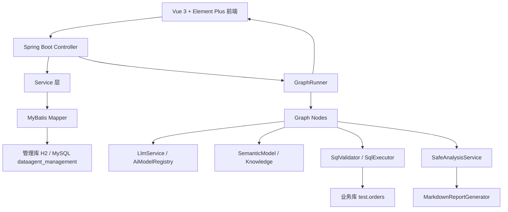

# DataAgent Rebuild 架构说明

## 1. 官方 DataAgent 与本项目关系

官方 DataAgent 是 Spring AI Alibaba 生态中的企业级智能数据分析 Agent，围绕 Text-to-SQL、Python 分析、智能报告、RAG 增强、多模型调度、MCP Server、API Key 管理等能力构建。

本项目是学习型重建，不是官方完整版本。它参考官方 DataAgent 的核心架构和模块边界，把系统拆成可理解、可运行、可演示的 MVP。

## 2. 本项目简化的能力

当前版本保留核心主链路：

- Agent 配置
- 模型配置
- 数据源配置
- 语义模型
- 业务知识
- Prompt 模板
- LLM 抽象
- Graph/SSE
- NL2SQL
- SQL 输出清洗与修复
- Schema Recall 关键词打分
- Relation Recall / JOIN 上下文
- Knowledge Recall / Mock Embedding RAG
- SQL 执行
- API Key / Datasource Password 基础加密
- SQL LIMIT / maxRows / timeout 安全边界
- Python 沙箱分析 / Java 安全分析 fallback
- Markdown 报告
- ReportResult / ChartSpec / ECharts 展示
- Graph Run History / Graph Event History
- Human-in-the-loop SQL confirmation

当前版本简化或暂未实现：

- 外部向量库 RAG
- SQL 自动修复
- 更复杂的多表 JOIN 智能规划
- 复杂 BI 看板
- PDF/Word 导出
- KMS / Vault 级密钥管理
- 登录权限
- MCP Server

## 3. 当前架构图



## 4. 后端模块说明

- `controller`：对外 REST API，统一返回 `ApiResponse`。
- `service`：业务规则层，检查是否存在、是否重复、是否启用。
- `mapper`：MyBatis 注解 SQL，负责管理库读写。
- `entity`：数据库表映射对象。
- `dto`：请求对象，避免 Controller 直接接收 Entity。
- `vo`：返回对象，避免敏感字段直接暴露。
- `converter`：DTO、Entity、VO 转换。
- `security`：密钥加密、脱敏、SQL 安全配置和敏感日志脱敏。
- `graph`：工作流状态、事件、节点和执行器。
- `service/graphhistory`：运行历史持久化，保存 graph_run 和 graph_event。
- `nl2sql`：意图识别、Schema 召回、关键词打分、Relation Recall、Knowledge Recall、SQL 生成、SQL 提取、SQL 修复、校验和执行。
- `analysis`：Java 安全统计、受限 Python 沙箱执行、fallback 和报告生成。
- `prompt`：Prompt 常量、默认模板和渲染器。
- `llm`：模型客户端抽象、mock 客户端和 OpenAI-compatible 客户端。

## 5. 前端模块说明

- `src/api`：Axios API 封装。
- `src/layouts`：后台布局和侧边菜单。
- `src/router`：路由定义。
- `src/views`：管理页面和运行中心。
- `src/styles`：全局样式。

前端页面包括：

- 首页
- 运行中心
- 运行历史
- Agent 管理
- 模型配置
- 数据源管理
- Agent 数据源绑定
- 语义模型
- 知识管理
- Prompt 模板

## 6. Graph 节点说明

`chat` 模式：

1. `StartNode`
2. `LoadAgentNode`
3. `LoadContextNode`
4. `CallLlmNode`
5. `FinishNode`

`nl2sql` 模式：

1. `StartNode`
2. `LoadAgentNode`
3. `IntentRecognitionNode`
4. `SchemaRecallNode`
5. `RelationRecallNode`
6. `KnowledgeLoadNode`
7. `SqlGenerateNode`
8. `SqlValidateNode`
9. `SqlRepairNode`
10. `HumanConfirmNode`
11. `SqlExecuteNode`
12. `PythonAnalyzeNode`
13. `ReportGenerateNode`
14. `Nl2SqlAnswerNode`
15. `FinishNode`

## 7. NL2SQL 链路说明

NL2SQL 被拆成多个步骤，而不是一次性让模型输出最终答案：

- 意图识别：判断是否数据查询。
- Schema 召回：读取 Agent 绑定数据源下的语义模型，并根据表名、业务名、同义词、描述和字段命中情况做打分。
- 关系召回：根据已召回的表，从 `semantic_relation` 中找出可用的 JOIN 条件。
- Fallback：如果没有关键词命中，退回到少量启用表字段，避免链路断掉。
- 知识加载：优先用 embedding 检索 Agent 绑定知识的相关 chunks，没有 embedding 时回退到关键词/绑定知识拼接。
- SQL 生成：调用 LLM 或 mock fallback，并保留真实模型 raw output。
- SQL 提取：从 Markdown 代码块、解释文本、多段 SQL 中提取第一条 SELECT。
- SQL 校验：只允许 SELECT / WITH SELECT，禁止危险语句、多语句、注释、危险函数和敏感系统表。
- SQL 修复：校验失败时先规则清洗，再通过 `sql_repair` Prompt 尝试 LLM 修复。
- 人工确认：可在 SQL 执行前进入 `pending_confirm`，用户确认、修改或取消。
- SQL 执行：通过 JDBC 查询业务库，自动追加 LIMIT，限制最大行数，并设置 query timeout。
- 分析报告：对结果做基础统计，生成 Markdown、结构化 ReportResult 和 ChartSpec。

SQL 生成链路现在是：

```text
schema / relation / knowledge recall -> raw output -> extract -> validate -> repair -> execute
```

修复后的 SQL 仍必须再次通过 `SqlValidator`，不会执行未校验 SQL。

Schema Recall 从“全量拼接所有启用表字段”升级成“只返回 topN 表和 topM 字段”，可以显著降低 Prompt 噪声。第 20 轮又把 JOIN 条件建模成 `semantic_relation`，通过 `RelationRecallNode` 明确告诉模型如何连接表，而不是让它猜 JOIN 条件。第 21 轮继续把知识从“全量拼接”升级为“检索 topK KnowledgeChunk”，当前用 MySQL 存向量 JSON 和 Java 余弦相似度实现了一个轻量可运行的 RAG 骨架。第 22 轮把报告从 Markdown 原文升级为结构化 `ReportResult`，并自动生成 `ChartSpec` 供前端 ECharts 展示。第 23 轮新增 AES-GCM 密钥加密和 SQL 执行安全边界，保护模型 API Key、数据源密码，并防止运行中心的大查询或危险 SQL 拖垮业务库。第 24 轮新增运行历史持久化，普通 run 和 SSE run 都会保存主记录和节点事件，方便刷新页面后复盘成功和失败链路。第 25 轮在 SQL 执行前加入 `HumanConfirmNode`，允许用户在前端确认、修改 SQL 或取消执行；修改后的 SQL 仍必须重新通过安全校验。

## 8. 安全增强说明

模型配置的 `apiKey` 和数据源的 `password` 会在创建和更新时通过 `SecretService` 加密后入库，格式为 `ENC:<iv>:<cipherText>`。密钥来自环境变量 `DATAAGENT_SECRET_KEY`，未设置时会使用 dev key 并打印 warning，仅适合本地演示。

查询列表和详情时，后端 VO 只返回：

- `hasApiKey` / `maskedApiKey`
- `hasPassword` / `maskedPassword`

历史明文数据仍可兼容读取；重新编辑保存后会转为加密值。SQL 执行侧会再次调用 `SqlValidator`，自动追加 LIMIT，设置 `Statement.setQueryTimeout`，最多读取配置的 `maxRows` 行，并在 GraphRunVO 中返回 `sanitizedSql`、`sqlLimited`、`sqlResultTruncated` 和 `sqlSecurityMessage`。

## 9. 运行历史说明

运行历史由两张表组成：

- `graph_run`：一条记录对应一次运行，保存 runId、sessionId、Agent、模型、问题、回答、状态、SQL、结果预览、报告、Recall 统计和错误摘要。
- `graph_event`：一条记录对应一个节点事件，保存 nodeName、eventType、status、message、dataJson 和 eventTime。

`GraphRunner` 在开始运行时调用 `GraphHistoryService.startRun`，每次 `GraphEventEmitter` 产生事件时调用 `saveEvent`，运行结束后调用 `finishRun` 汇总最终状态。历史写入是旁路逻辑，写入失败不会中断 Graph 主链路。

历史中的 `dataJson`、错误信息和结果预览都会先经过 `SensitiveLogUtils` 脱敏，避免把 API Key、数据库密码、Bearer Token 或 `DATAAGENT_SECRET_KEY` 写回管理库。结果预览只保存前 20 行，避免历史表随着大结果无限增长。

## 10. Human-in-the-loop 说明

`HumanConfirmNode` 位于 `SqlRepairNode` 和 `SqlExecuteNode` 之间。当请求参数 `confirmBeforeExecute=true` 时，Graph 会在生成并校验 SQL 后暂停：

- `graph_run.status=pending_confirm`
- `confirm_status=pending`
- `confirm_sql` 保存待确认 SQL
- `graph_event` 写入 `human_confirm_required`

确认接口会从历史记录恢复 runId、sessionId、Agent、数据源和 SQL 等上下文，只继续执行 SQL 执行、分析、报告和最终回答节点。取消接口会把状态写成 `canceled`，并写入 `human_cancel` 事件。人工修改 SQL 后仍会重新经过 `SqlValidator`、自动 LIMIT、maxRows 和 queryTimeout，不能绕过安全规则。

## 11. H2 / MySQL profile 说明

默认 profile 是 H2：

```yaml
spring:
  profiles:
    active: h2
```

H2 适合快速开发，但管理数据可能随重启丢失。

MySQL profile 使用：

```powershell
mvn -gs .mvn\settings.xml -pl data-agent-management spring-boot:run "-Dspring-boot.run.arguments=--spring.profiles.active=mysql"
```

MySQL profile 会连接 `dataagent_management`，用于持久化管理配置。

## 12. 管理库 / 业务库说明

管理库：

- 名称：`dataagent_management`
- 保存：Agent、ModelConfig、Datasource、SemanticModel、Knowledge、Prompt 等配置。

业务库：

- 名称：`test`
- 保存：真实业务数据，例如 `orders`。

DataAgent 不把业务数据复制到管理库，只在 `datasource` 表里保存业务库连接信息。

## 13. Python 沙箱链路

默认情况下 `dataagent.analysis.python.enabled=false`，`PythonAnalyzeNode` 走 Java 安全统计，保证没有 Python 环境也能运行。

开启后链路为：

```text
SQL Result
-> PythonCodeGenerator 生成模板统计代码
-> PythonCodeSafetyChecker 静态检查危险 import / 函数
-> LocalPythonSandboxExecutor 使用 ProcessBuilder 执行
-> stdout JSON 解析为 analysisResult
-> 失败时 fallback 到 Java 安全统计
```

沙箱限制：

- 不执行用户任意 Python。
- 不使用 shell。
- 清理敏感环境变量。
- 临时目录执行，执行后清理。
- 设置 timeout 和 stdout/stderr 最大长度。
- 禁止 `os/subprocess/socket/open/eval/exec/__import__` 等危险能力。

该能力是学习型受限执行器，不是生产级安全沙箱。

## 14. DataAgent Rebuild v2.0 最终状态

v2.0 已完成从配置管理、语义建模、知识召回、NL2SQL、SQL 安全执行、人工确认、分析报告、运行历史到前端展示的完整演示闭环。后续如果继续贴近官方 DataAgent，可重点增强 MCP Server、生产级 RAG、生产级沙箱、权限审计和部署体系。
